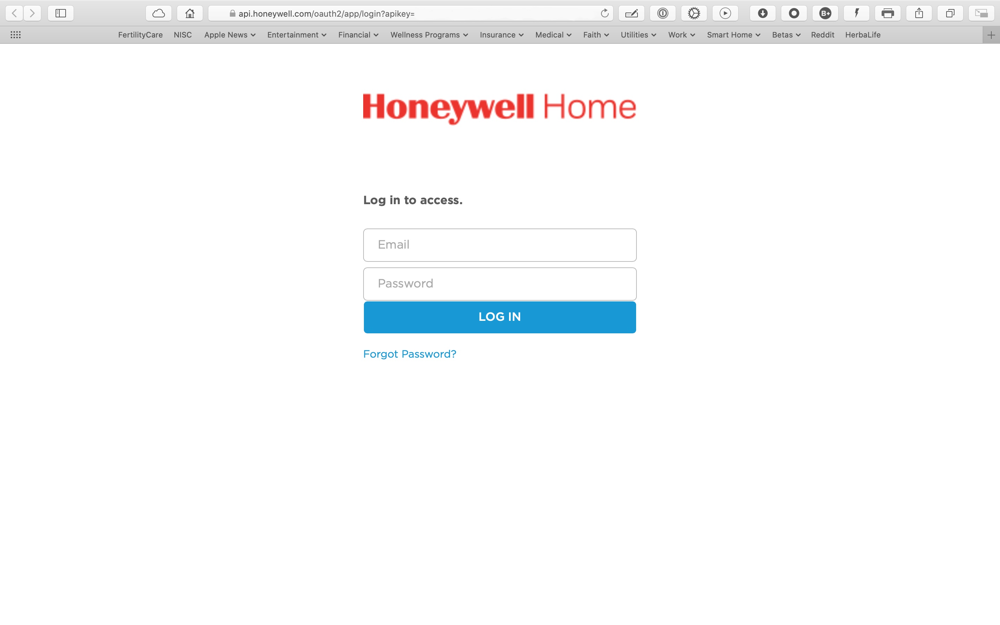
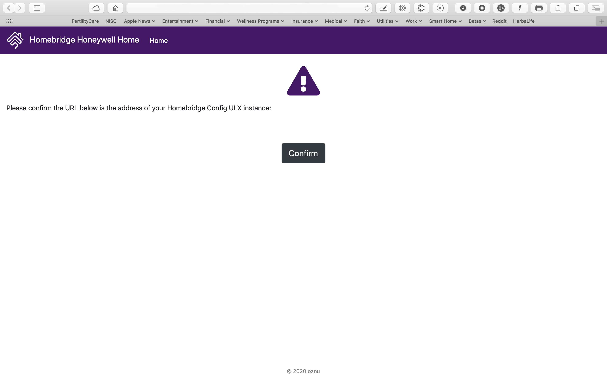

# Honeywell Home plugin for Homebridge

A [Honeywell Home](https://honeywellhome.com) plugin for [Homebridge](https://homebridge.io/).

This Honeywell Home plugin for Homebridge allows you to control your T5, T6 and T9 Honeywell Home thermostats from HomeKit.

If you would like to help out with this plugin you can reach out to me on [@slack](http://homebridgeteam.slack.com/)

Huge Thanks to [@mkellsy](https://github.com/mkellsy) and [@homespun](https://github.com/homespun) for getting this plugin to were it is. Also a big thank you to [@oznu](https://github.com/oznu) for implimenting write to honeywell's API and adding his zero-config portal ui for homebridge-config-ui-x.

## Installation
Option 1: Install via Homebridge Config UI X:

Search for "Honeywell Home" in homebridge-config-ui-x and click Install.

Option 2: Manually Install:

npm install -g --unsafe-perm homebridge-honeywell-home

## Configuration
To configure [homebridge-honeywell-home](https://www.npmjs.com/package/homebridge-honeywell-home) you must also be running [homebridge-config-ui-x](https://github.com/oznu/homebridge-config-ui-x).

* Navigate to the Plugins page in homebridge-config-ui-x.
* Click the Settings button for the Homebridge Honeywell Home plugin.
* Click the Link Account button.
* Sign in with your HoneywellHome account.
* Your account is now linked.
* Restart Homebridge for the changes to take effect.
  

## Manaul Config

  Visit Manual Config [Wiki](https://github.com/donavanbecker/homebridge-honeywell-home/wiki/Manual-Config)

## Optional Config

  Visit Optional Config [Wiki](https://github.com/donavanbecker/homebridge-honeywell-home/wiki/Optional-Config)
