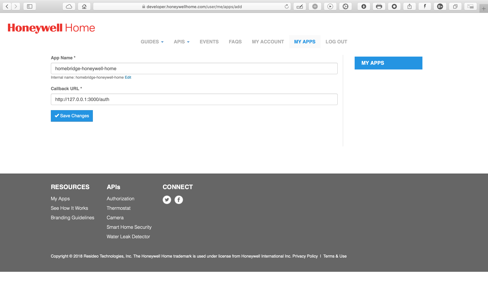
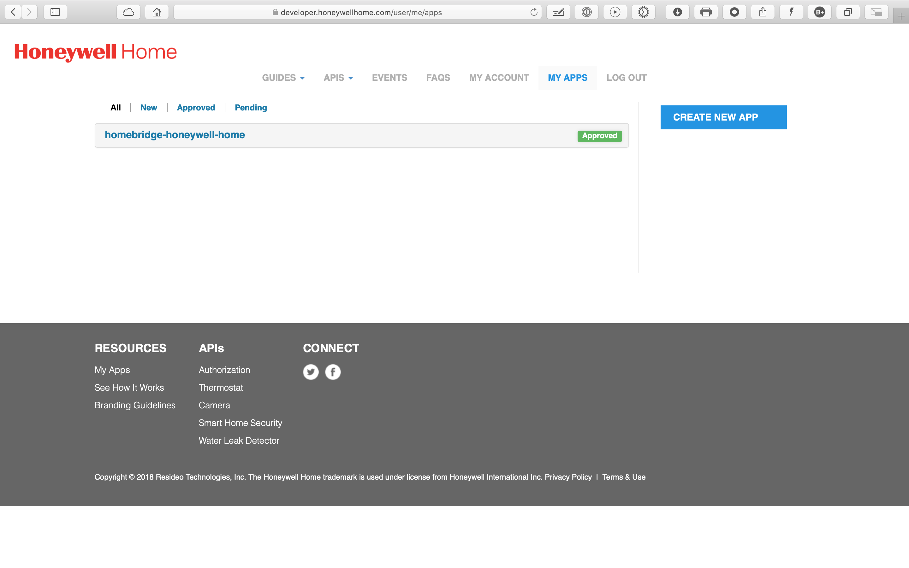
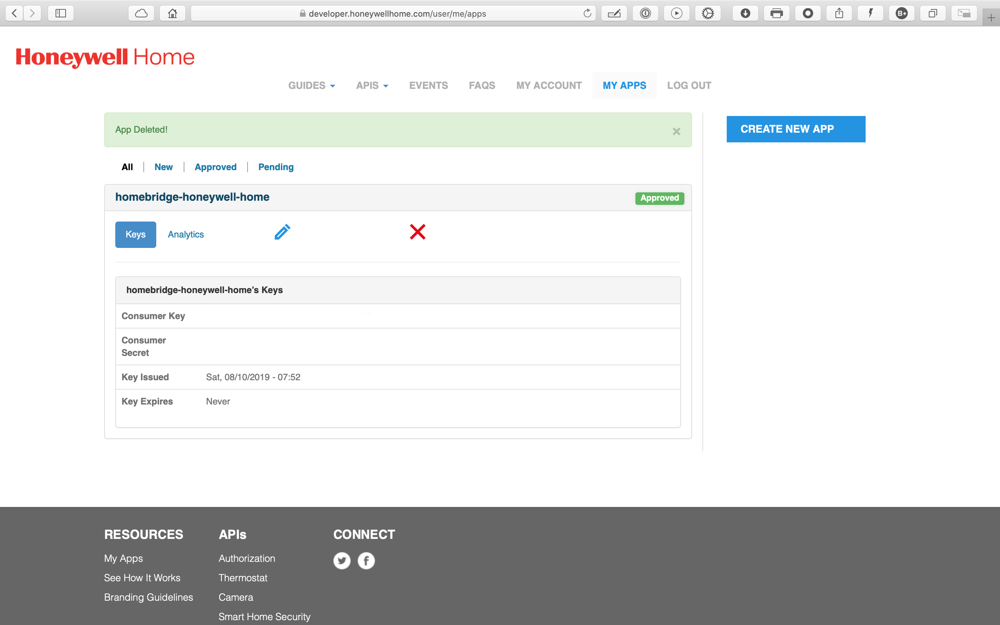
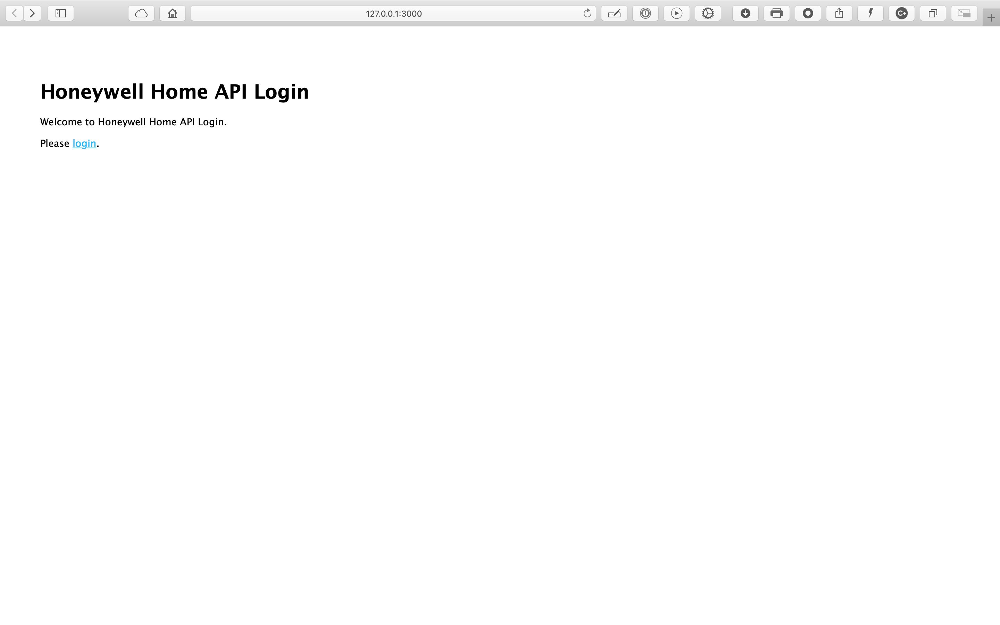
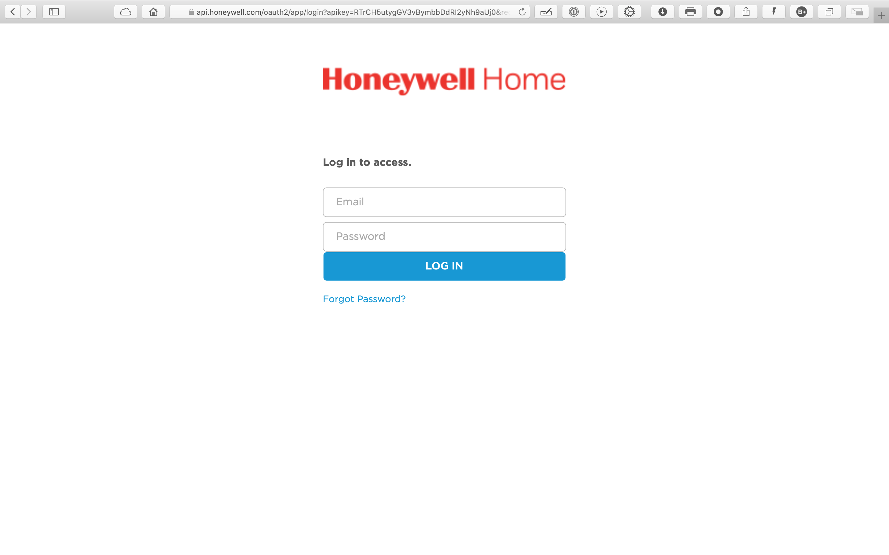
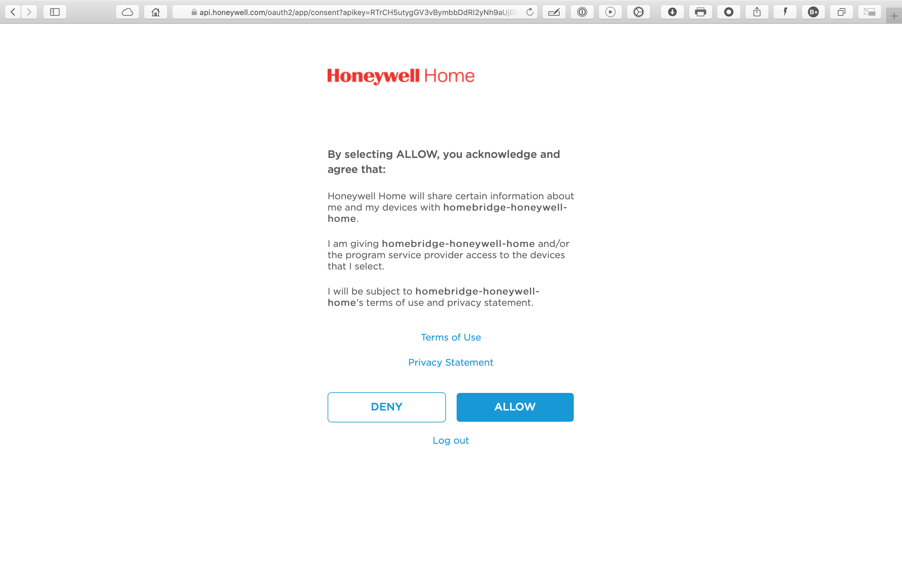
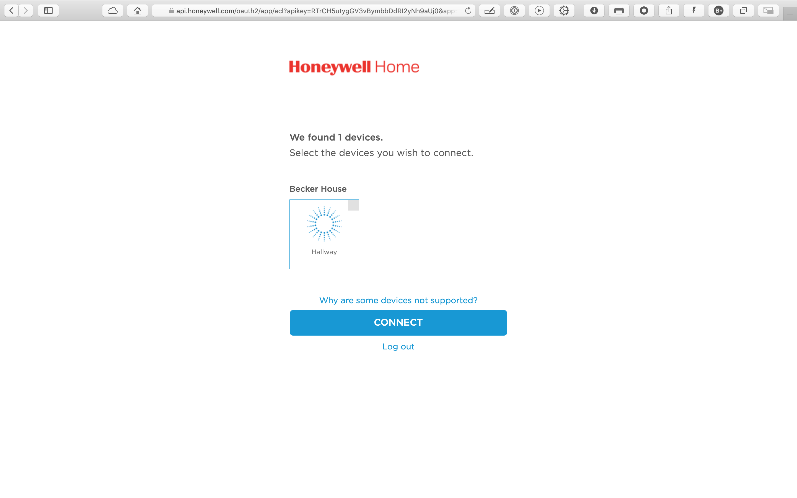
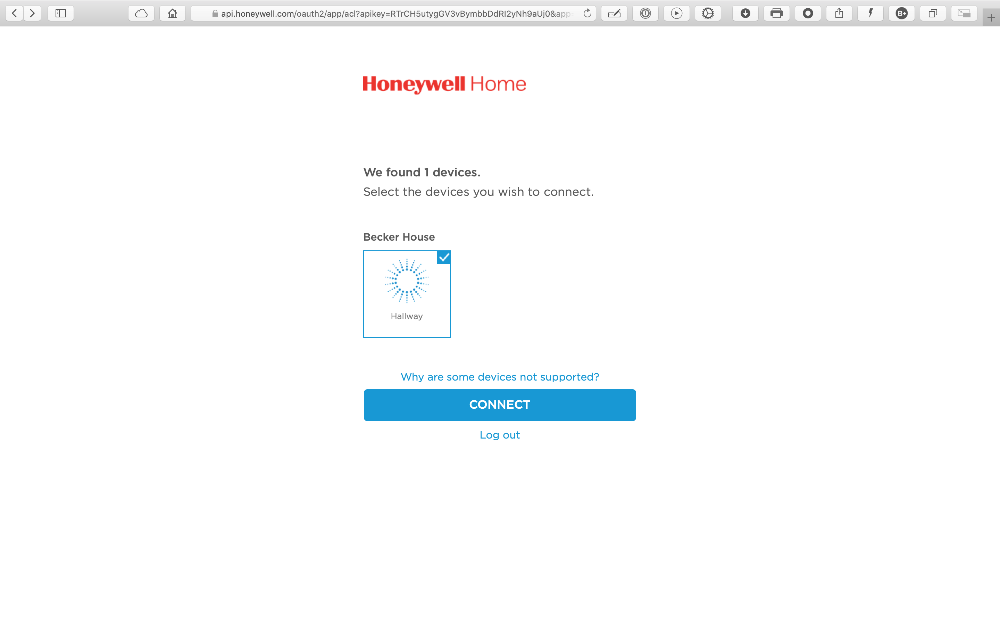

# Honeywell API

 
  
  Simple web server to retrieve credentials for using the [Honeywell Home service](https://developer.honeywell.com/).
  

The process requires two separate logins:

1. A login for a developer site to generate API keys.
You probably don't have a login for this site,
but that's OK, because the [instructions below](#api-keys) explains the process.

2. A login for a service to authorize an application.
You probably already have a login for this service,
because you've already created a login when you started to use the
[Honeywell Home App](https://getconnected.honeywellhome.com/en/honeywell-home-app).

# API Keys
First,
generate two parameters, a `consumerKey` and a `consumerSecret`:

1. Go to the Honeywell Home [developer site](https://developer.honeywell.com/).

2. If you have already registered, click on `LOGIN`;
otherwise, you will have to create an account, click on `SIGNUP`.

3. Once you have logged in, click on `MY APPS` and then on `CREATE NEW APP`.
You will be asked to enter an `App Name` and a `Callback URL`.
Please enter the values you see here: 
_(Protip: copy-paste the values from the file`config/options.global.js`.)_

4. After you click on `Save Changes`, you will see something like this: 

5. Now click on `homebridge-honeywell-home` and you will see something like this: 

6. Edit the file `config/options.global.js` to include the values shown in your browser, e.g.,

        consumerKey: 'A5nV2bVn7Jzo4FzcZQyADZVGoxSrHAJe',
        consumerSecret: 'xjokooAQHWkqAEel'

7. Finaly, click on `LOG OUT`.

# Generate OAuth credentials

In the terminal:

    % npm start

This starts a `node ./app.js` process and opens up a browser window: 

Click on the `login` link: 

Enter the `Email` and `Password` that you use for your
[Honeywell Home App](https://getconnected.honeywellhome.com/en/honeywell-home-app) and click on `LOG IN`: 

Skim the text, and `Click on `ALLOW`: 

Select the devices that you want to manage, by clicking in the upper-right-hand corner of each device: 

Click on `CONNECT`: 

You will need to enter these *exact* values into the configuration section for your application,
e.g., for [homebridge-honeywell-home](https://github.com/d0n4v4nb3ck3r/homebridge-honeywellhome),
the file `~/.homebridge/config.json` would have this added to it:

        { "platform"         : "homebridge-honeywell-home"
        , "name"             : "HoneywellHome"
        , "credentials"      :
          { "consumerKey"    : "A5nV2bVn7Jzo4FzcZQyADZVGoxSrHAJe"
          , "consumerSecret" : "xjokooAQHWkqAEel"
          , "accessToken"    : "MbCNslDA5jJJdm8JRhGOXWKdPYKQ"
          , "refreshToken"   : "YgOEocILQcPySJiLod33UzPXNFDE4rQ1"
          }
        , "options"          : { "ttl": 600, "verboseP" : false }
        }

You can now terminate the `node ./app.js` process started earlier.

Enjoy!
